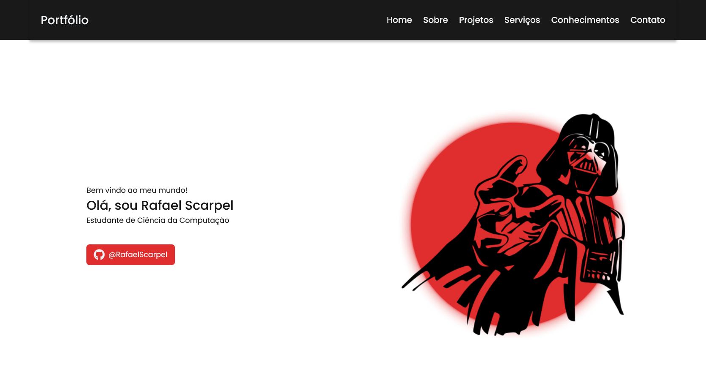

# Portfólio

Este repositório contém o portfólio desenvolvido durante o curso de Web Básico, como parte do trainee da empresa júnior byron.solutions.

## Descrição
A página consiste em um modelo de portfólio pessoal, contendo um resumo do perfil profissional e acadêmico, projetos desenvolvidos, serviços oferecidos, habilidades técnicas e informações de contato com links para as redes sociais. Foi desenvolvido com HTML e CSS.
